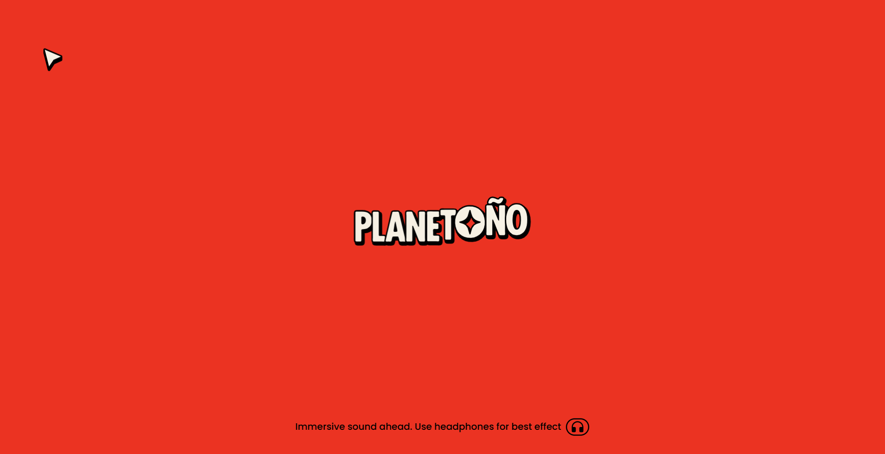
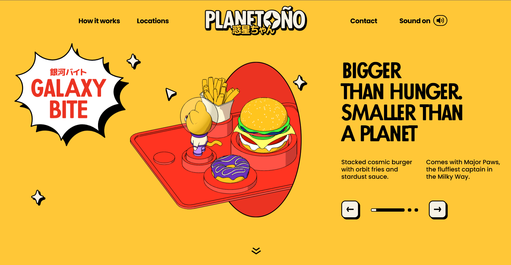
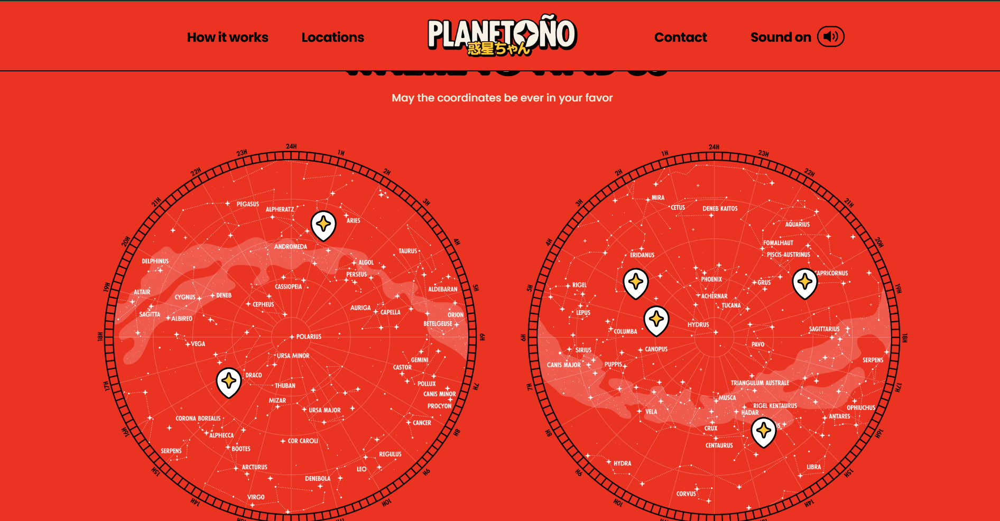

<div align="center">



# 🪐 GALAXY — Space Food Station

> A personal front-end portfolio project — an immersive, animated space-themed food experience.
> Built with Nuxt 3, Three.js, GSAP, Rive, and Storyblok.

[](https://the-drawn-dimenstion.sunilnathyogi008.workers.dev/)
[](https://nuxt.com)
[](https://threejs.org)
[](https://gsap.com)

**Frontend Development by [Sunil Nathyogi](https://linkedin.com/in/sunil-81340839a)**

</div>

---

## ✨ Preview

<table>
  <tr>
    <td align="center" width="50%">
      
      <br/>
      <sub><b>🍔 Hero — Galaxy Bite</b><br/>3D food explorer with animated product slider</sub>
    </td>
    <td align="center" width="50%">
      
      <br/>
      <sub><b>🗺️ Locations — Star Map</b><br/>Interactive constellation maps with clickable markers</sub>
    </td>
  </tr>
</table>

---

## 🚀 About This Project

**Planetoño** is a personal portfolio project I built to practice and showcase advanced front-end engineering skills. The concept: a fictional space food station where astronauts can order meals.

This project was my deep-dive into:
- 🌌 **WebGL / Three.js** — 3D model rendering with custom `.glb` files and Draco compression
- 🎮 **Rive animations** — interactive vector animations for the logo, nav items, and preloader
- 🎯 **GSAP ScrollTrigger** — complex scroll-driven animation sequences
- 🔊 **Web Audio API** — immersive spatial sound design
- ⚡ **Nuxt 3 + Storyblok CMS** — headless CMS with SSG static generation
- 📱 **Responsive design** — fully custom desktop and mobile layouts

---

## 🛠️ Tech Stack

| Technology | Role |
|---|---|
| **Nuxt 3** | Framework — SSG static generation |
| **Vue 3 + TypeScript** | Component architecture |
| **Three.js** | 3D WebGL scene with GLB models |
| **GSAP + ScrollTrigger** | Scroll-driven animations |
| **Rive** | Interactive vector animations |
| **Lottie** | Decorative particle effects |
| **Swiper** | Hero product carousel |
| **Lenis** | Smooth scroll momentum |
| **Storyblok** | Headless CMS for content |

---

## 📁 Project Structure

```
planetono/
├── app.vue                    # Root application entry
├── nuxt.config.ts             # Nuxt config (modules, chunks, CSS)
├── pages/
│   └── index.vue              # Home page — Storyblok data + SEO
├── layouts/
│   └── default.vue            # Global shell (header, cursor, preloader)
├── components/
│   ├── ThePreloader.vue       # Rive logo + GSAP fade-out
│   ├── TheHeader.vue          # Responsive header (desktop/mobile)
│   ├── TheHeaderDesktop.vue   # Scroll-reactive nav bar
│   ├── TheHeaderMobile.vue    # Hamburger + slide-down drawer
│   ├── TheCursor.vue          # Custom cursor with GSAP easing
│   ├── SectionHero.vue        # 3D hero scene + product slider
│   ├── SectionProcess.vue     # ScrollTrigger step reveal
│   ├── SectionLocation.vue    # Star map grid
│   ├── SectionContacts.vue    # Footer + social links
│   ├── HeroSlider.vue         # Swiper carousel
│   ├── SpaceMap.vue           # Constellation map canvas
│   ├── MapMarker.vue          # Popover location pins
│   └── ...20+ components
├── composables/
│   ├── useSound.ts            # Global HTML5 audio manager
│   ├── useLenis.ts            # Smooth scroll wrapper
│   ├── useScrollTrigger.ts    # GSAP ScrollTrigger + auto-cleanup
│   └── useTrack.ts            # Analytics events
├── storyblok/                 # CMS wrapper components (v-editable)
├── assets/css/main.css        # Design tokens, typography, utilities
└── _nuxt/                     # Production static build output
```

---

## ⚙️ Getting Started

### Prerequisites
- Node.js `18.18.0+` (see `.nvmrc`)
- A [Storyblok](https://storyblok.com) account for CMS content

### Installation

```bash
# Clone the repo
git clone https://github.com/Sunil56224972/Galaxy---Space-Food-Station-.git
cd Galaxy---Space-Food-Station-

# Install dependencies
npm install

# Configure environment
cp .env.example .env
# → Add your STORYBLOK_TOKEN to .env

# Start development server
npm run dev
```

### Build for Production

```bash
npm run generate   # Static site generation
npm run preview    # Preview the production build locally
```

---

## 🌐 Live Demo

👉 **[the-drawn-dimenstion.sunilnathyogi008.workers.dev](https://the-drawn-dimenstion.sunilnathyogi008.workers.dev/)**

> 🎧 **Use headphones** — the site has immersive spatial audio designed for headphone listening.

---

## 👨‍💻 Author

**Sunil Nathyogi** — Frontend Developer

[](https://linkedin.com/in/sunil-81340839a)
[](https://instagram.com/kali_linux_user_)
[](mailto:sunilnathyogi008@gmail.com)
[](https://github.com/Sunil56224972)

---

## 📄 License

This project is for **portfolio and educational purposes**.

---

<div align="center">

Built with ♥️ by **Sunil Nathyogi**

© 2024 Sunil Nathyogi

</div>
